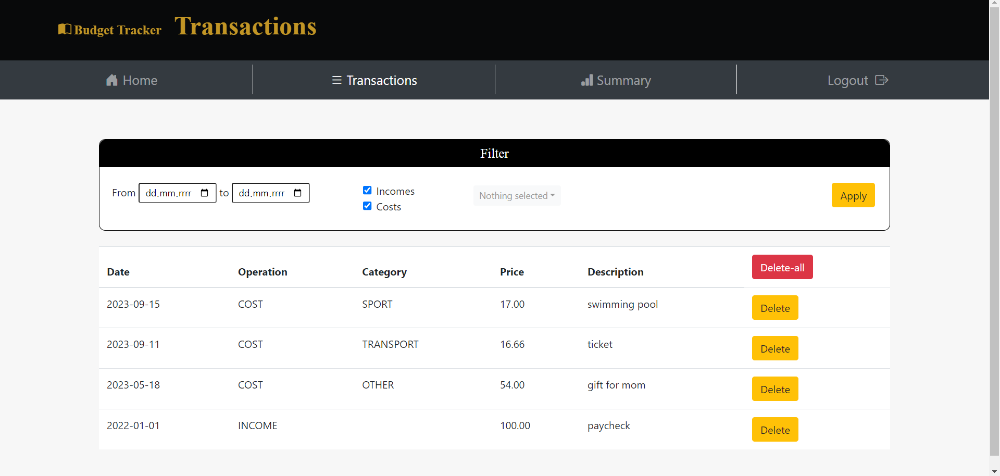
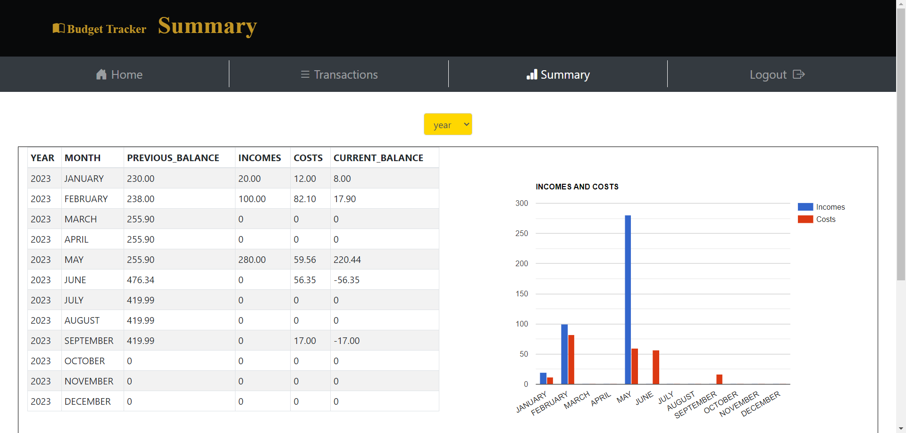
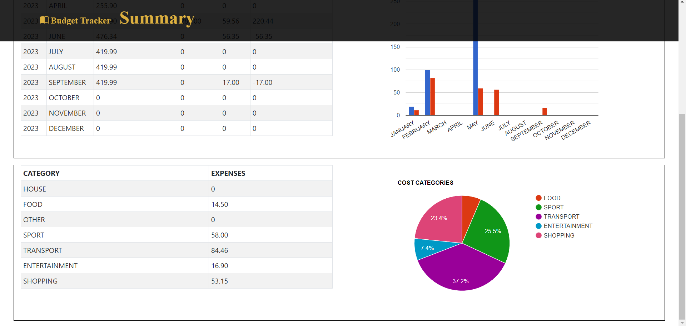

# BudgetTracker

## About the project

Budget Tracker is an application to record and analyze your expenses. The application gives the user the ability to add
income and expenses. The summaries are divided into monthly or yearly with the expenses listed by category.

## Technologies

* Spring Boot 3.0.2
* Thymeleaf
* Bootstrap v4.1.3
* Google Charts API

## For developers
Application starts on port localhost:/8090/user .
The PostgreSQL database was used in the project.

The following dependencies are downloaded with spring boot: 
* spring-boot-starter-security, 
* spring-boot-starter-data-jpa,
* spring-boot-starter-thymeleaf, 
* spring-boot-starter-web, 
* lombok,

## TODO
* Option to export summaries to excel
* Option to add your own categories by user
* Ability to add a list of transactions by uploading a file
* Change the appearance of the transaction list
* Add user settings
* Add OAuth2